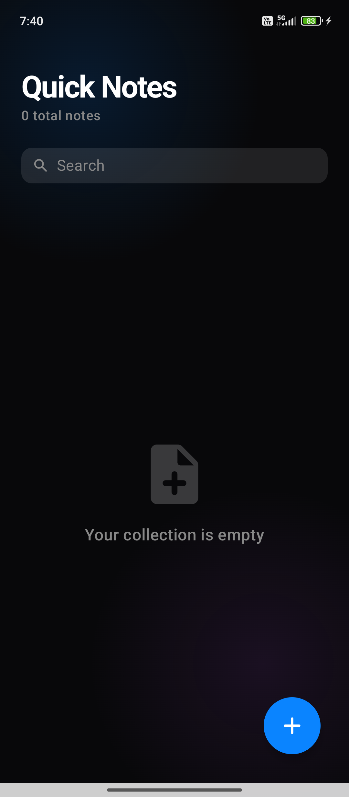
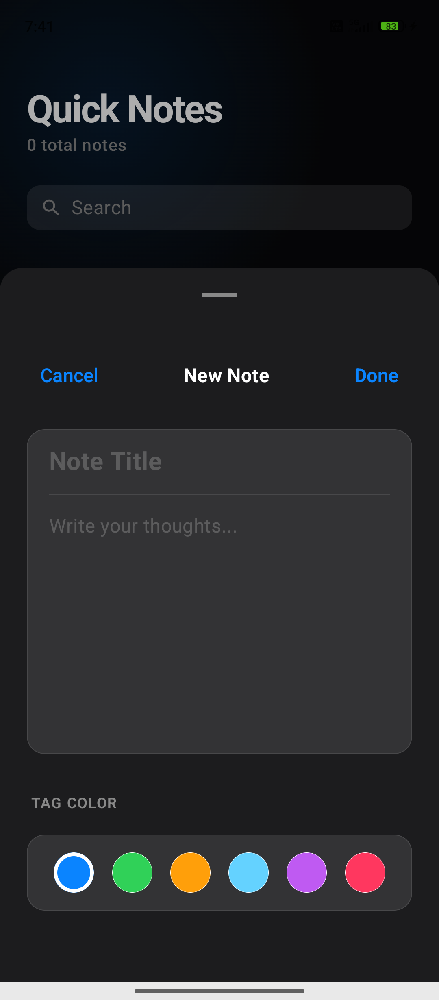
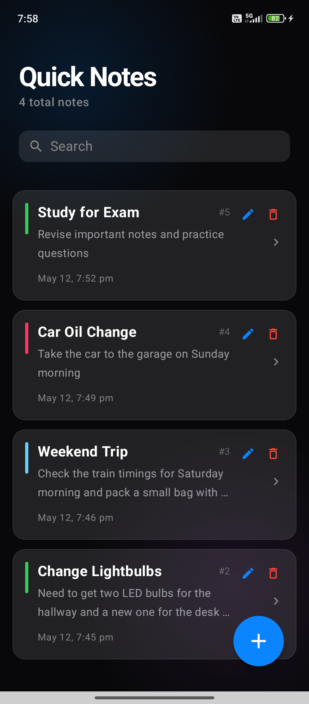
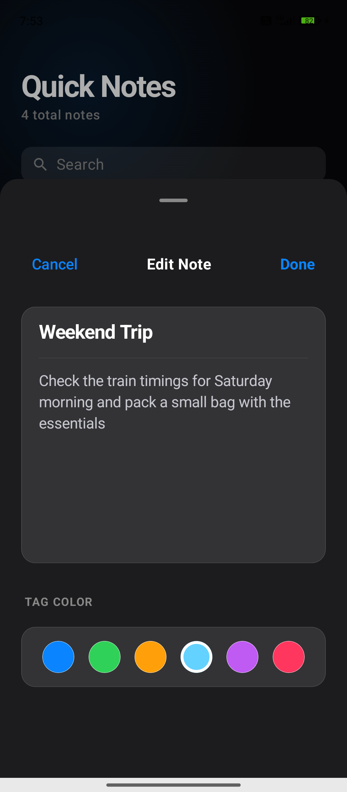
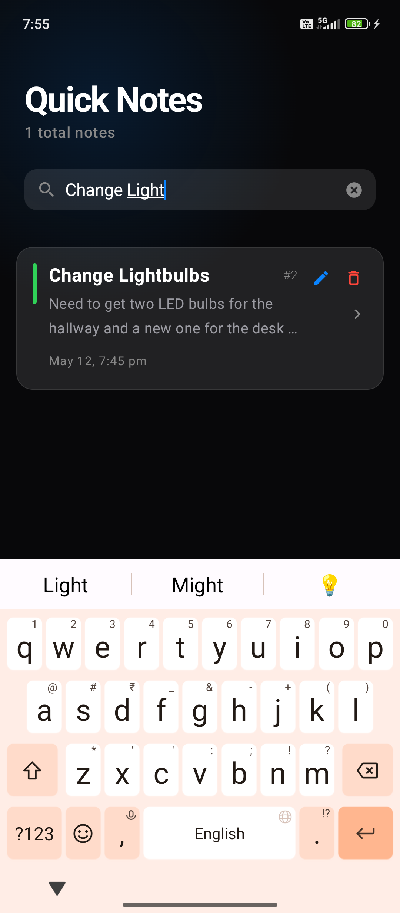
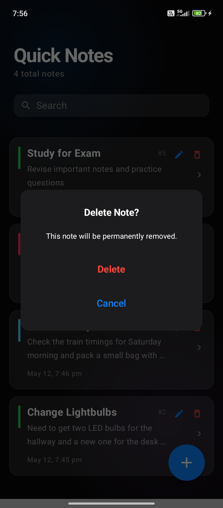

# Quick Notes 📓

### **Maincrafts Technology Internship**
**Android App Development: Task 1 & Task 2 Project**

Welcome to **Quick Notes**, a premium, high-performance note-taking application developed during my internship at Maincrafts Technology. This project demonstrates a complete evolution from a basic prototype to a production-ready Android application.

---

## 🕒 Task 1: Project Foundation
In the first phase, I established the core functionality of the app using Jetpack Compose.
- **Objective**: Build a functional UI for note management.
- **State**: In-memory storage (Data cleared on app restart).
- **Details**: [**View Task 1 Legacy Documentation & Screenshots**](TASK1_README.md)

---

## 🚀 Task 2: Persistence & Premium Overhaul (Current)

**Task 2** marks the transformation of the app into a real-world utility with robust local data management and a "Liquid Glass" iOS-inspired aesthetic.

### **What's New in Task 2?**
- **Local Data Persistence**: Full integration of **Room Database** ensures your notes are never lost.
- **Advanced Architecture**: Implemented **MVVM** pattern with a Repository layer for clean, scalable code.
- **Liquid Glass UI**: A complete visual redesign featuring glassmorphism, glowing background blobs, and iOS-style structural components.
- **Persistent Identification**: Every note is assigned a permanent serial ID (e.g., #1) that stays consistent even after app restarts.

### **Technical Objectives Achieved**
- [x] Room Database implementation for SQLite ORM.
- [x] Full CRUD operations (Create, Read, Update, Delete) synced with the DB.
- [x] Reactive UI updates using Kotlin StateFlow and ViewModel.
- [x] Implementation of Production-Level Android Architecture.

---

## 📱 App Walkthrough (Task 2)

### **1. Main Collection Screen**
A sleek, dark interface showing your total note count and a glassy search bar. The background features subtle, liquid-like glowing gradients.

### **2. Adding a New Note**
An iOS-style bottom sheet for quick entry. Features a high-quality "Material" input group where the title and description are perfectly separated within a single glassy container.

### **3. Local Data & Persistent IDs**
The core feature of Task 2. Every note identifies itself with a persistent ID (e.g., #1, #2). 
- **Persistence Test**: Enter a note -> Restart App -> The note and its ID remain exactly as they were.

### **4. Editing a Note**
Modify your thoughts or change the organizational "Tag Color" instantly. The sheet updates to "Edit Note" mode with a "Done" action to sync changes to the database.

### **5. Smart Search**
A refined search experience that filters your local database in real-time as you type, highlighting relevant notes instantly.

### **6. Safe Deletion**
Long-press or use the explicit delete icon to trigger an iOS-style confirmation dialog before permanently removing a note from the local storage.

---

## 🛠 Tools & Technologies Used
- **Language**: Kotlin
- **UI Framework**: Jetpack Compose
- **Database**: Room (SQLite)
- **Architecture**: MVVM (Model-View-ViewModel)
- **Concurrency**: Kotlin Coroutines
- **State Management**: StateFlow
- **Design Inspiration**: iOS Liquid Glass / Glassmorphism

---
