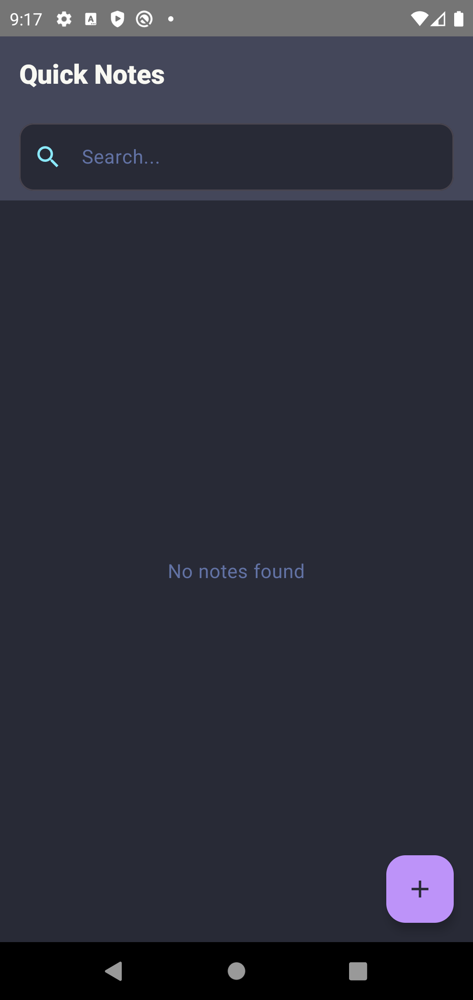
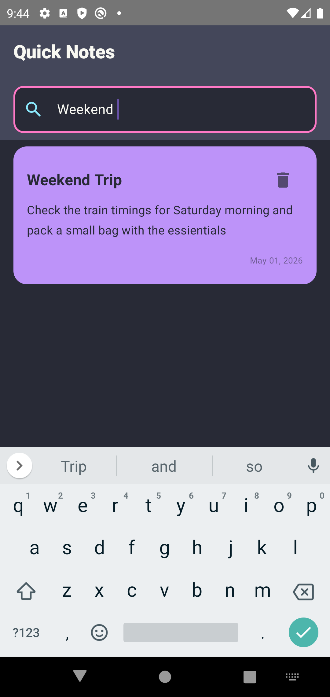
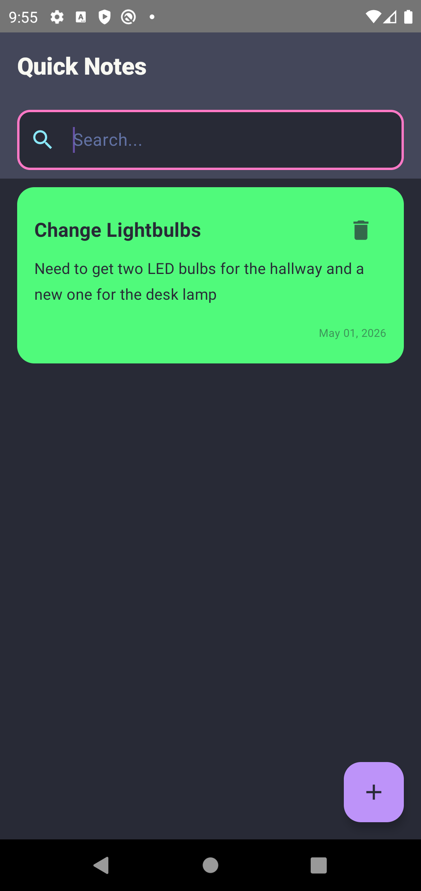

# Quick Notes

A simple and clean notes application built with Kotlin and Jetpack Compose. This is Task 1 for my Android development internship.

## Features
- Add, Edit, and Delete notes easily.
- Real-time search to find notes by title or body.
- Color selection for organizing notes.
- Automatic date tracking.
- Sleek dark theme UI.

## App Walkthrough

### 1. Main Screen
When you first open the app, you see a clean, empty state ready for your first note.

### 2. Adding a New Note
Clicking the floating "+" button opens a dialog where you can enter a title and description, and pick a color for your note.

### 3. Your Notes List
Once you've added a few notes, they appear in a beautiful list with their selected colors and the date they were created.

### 4. Editing a Note
Tapping on any note allows you to change its content or color instantly.

### 5. Smart Search
The search bar at the top lets you filter through your notes in real-time by searching for keywords in the title or body.

### 6. Deleting Notes
Each note has a delete icon to quickly remove notes you no longer need.

## Built With
- Kotlin
- Jetpack Compose
- ViewModel & StateFlow
- Material 3 components
