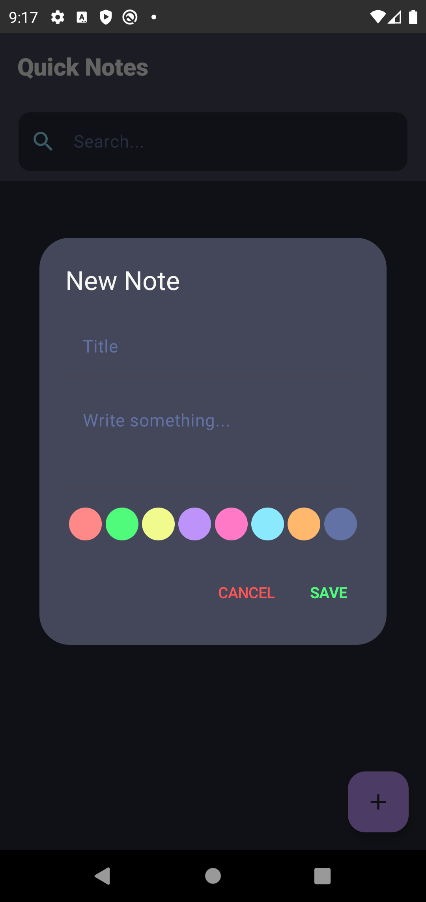
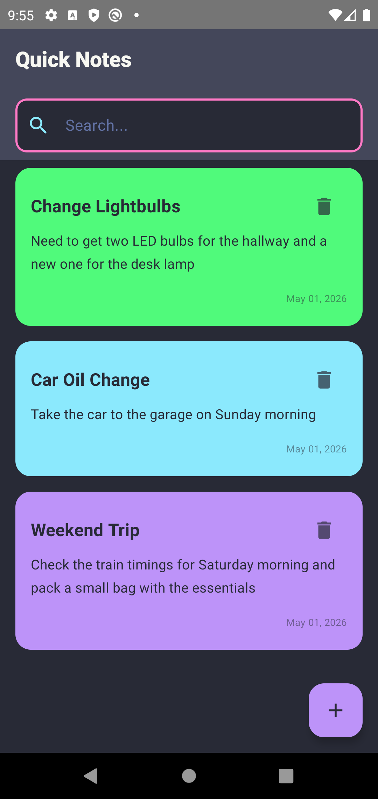
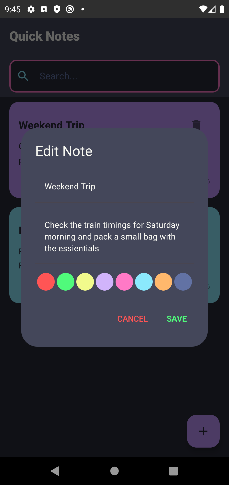

# Quick Notes - Task 1 (Legacy)

This document contains the original documentation and features for the initial phase of the Quick Notes project.

## Project Overview
In **Task 1**, a basic Notes application was built with the following characteristics:
- **Temporary Storage**: Notes were stored in-memory.
- **Data Lifecycle**: Data was lost whenever the application process was killed or the app was closed.
- **Initial UI**: A functional but basic interface for creating and viewing notes.

## Features (Task 1)
- Add new notes with a title and content.
- Delete notes from the list.
- Search notes locally in the memory list.
- Basic color selection for note organization.

## App Walkthrough (Task 1)

> [!NOTE]
> All screenshots in this section represent the UI as it appeared at the end of Task 1.

### 1. Home Screen
The starting point where users can view their active (temporary) notes.

### 2. Adding a Note
The original interface for capturing thoughts.

### 3. List View
Displaying multiple notes before any process restart.

### 4. Editing a Note
A basic popup/sheet to modify your existing temporary notes.

### 5. Smart Search
Filtering your active list of notes in real-time as you type.

### 6. Deleting Notes
Simple long-press or tap action to remove notes from the temporary list.

## Built With (Task 1)
- Kotlin
- Jetpack Compose
- ViewModel & StateFlow
- Material 3 components

---
**[Back to Main README](README.md)**
